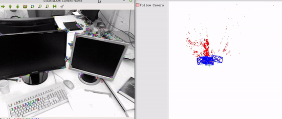

### Clean Slam (In Progress)
Re-implementation of ORB-SLAM from scratch, as a learning process of the author.

Clean Slam uses modern C++ 14/17 features, boost (state machine/graph), opencv, g2o, etc.

The code is written to be clean and easily understandable for people who want to learn SLAM.

A [docker ](https://github.com/xeonqq/slam_docker) is provided with all the dependencies installed to run clean slam 

### Demo
using rgbd_dataset_freiburg1_xyz dataset: (only key frames are drawn)

